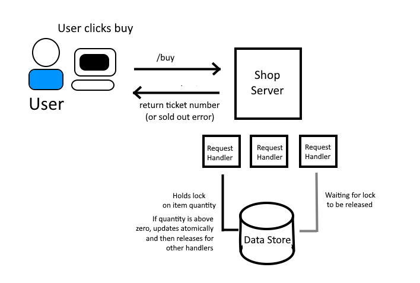

# ABExercise

# Online Shop REST Service (Prototype)

## Architecture Diagram



> _Diagram showing request interaction between user clicking buy and the flow within the backend, between request handler workers and the data store holding the quantity of items.

---

## Concurrency Strategy

This service is designed to safely handle hundreds of concurrent purchase requests. It does this by employing atomic variables to hold the two key values, quantity and ticket number. These values are protected from concurrent read/write problems at the hardware level, ensuring that multiple concurrent requests do not lead to overselling an item, while giving it an edge over other methods such as mutex locks which could become prone to deadlock issues and could cause blocking between workers.

---

## Scalability

As a further improvement to this service I would decouple the server from the data stores using Redis and a database, thereby making the server itself stateless. This brings a big advantage in that it will enable the service to scale horizontally, allowing it to support a large number of concurrent users.

---

## Candidate Notes and Instructions

### How to Run

   ```bash
   ./start.sh
   ```

This should run both client and server, accessible via http://localhost:5173

## Architectural Decisions

For this project I opted for use of atomic variables over traditional mutex locks for the concurrency strategy as they protect against concurrent accesses at the hardware level. This gives the advantage of avoiding deadlock situations as the project evolves and prevents blocking during access which could improve performance as many users attempt to buy at once. This will ensure that two or more users clicking buy at the same time while quantity is low will result in only one user getting the final item, avoiding overselling. A simple idempotency mechanism was also implemented to prevent concurrent identical requests resulting in multiple unintended purchases.

## Known Limitations

If I had more time, I would set up a proper database for retrieving the item information, and use a Redis cache to decouple state from the service and allow for greater scalability. I would also implement a TTL routine for the idempotency mechanism (perhaps in a database table with an SQL job running periodically) to prevent a backlog of old request records. On top of this, it would be great to make the frontend adapt properly to a mobile screen width, as well as a spinner animation on the buy button during loading to better signal to the user that their request is being processed.
